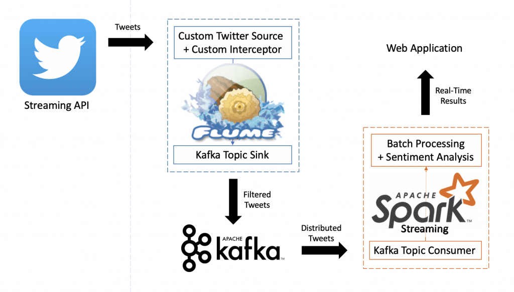

# bigdata-realtime-twitter-analysis
Personal project where I perform some analytics (including Sentiment Analysis) over a Twitter Stream using Big Data Technologies of the Hadoop echosystem such as Flume, Kafka, and Spark Streaming.

If you want to know more about this project, you can see a detailed explanation in ~~my personal blog~~ the docs folder of this repo.

This Git repository contains:
- Flume 
  - Custom Components to Stream and Filter Tweets (Custom Event Driven Source and Custom Interceptor)
  - Flume Agent Configuration File
  
- Spark Streaming: Code in Python for a real-time Twitter sentiment analysis using TextBlob (PyCharm Project)

- Dashboard: Flask Web Application for displaying the results using Chart.js (PyCharm Project)

- Docs: containing originial posts published on my old blog.
