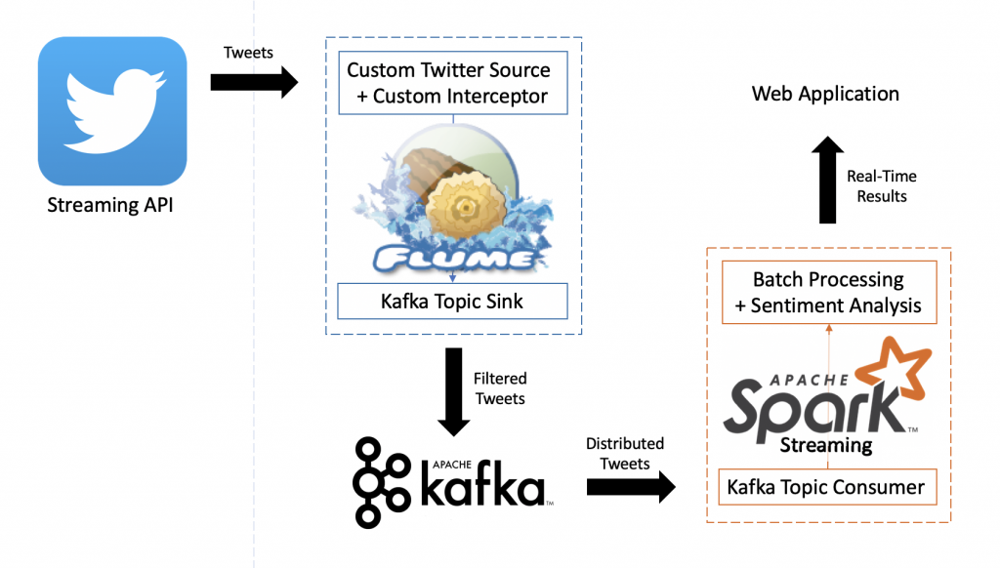

# Real-Time Twitter Analysis: Introduction

After setting up the Cloudera’s Quickstart VM, as described in my previous post, it’s time to show some hands-on experience about Data Engineering.

For this purpose, I opted for performing a real-time sentiment analysis over this social media. The idea is to put into play different tools and skills I got during the Big Data Development course that I haven’t spoken about in this blog before. Thus, along this project, I’m using technologies such as Flume, Kafka, Spark Streaming.

## Project Architecture and Data Pipeline

The following picture illustrates the architecture and the data pipeline designed for this project.

First, we need a stream of tweets from Twitter, to do so, we’ll make use of the Twitter API.

In order to use this API, and ingest the tweets to our cluster, we’ll use Flume, a tool for data ingesting. Here, we’re also implementing a custom (event-driven) source using the Twitter4j library that will help us to interact with the Twitter API, and a custom interceptor to filter-out all those tweets not written in English (to reduce the text analysis complexity later on). All the accepted tweets will end up on a Kafka topic, by configuring Kafka as a sink.

Then, we’ll use Spark Streaming jobs written in Python, to process and analyze every 5 seconds, the latest tweets received during a window of the last 30 minutes. In this analysis, we’ll calculate the most used hashtags, the users most mentioned, and the most active users. Moreover, we’ll perform a sentiment analysis by using the TextBlob library, to categorize tweets as positive, neutral, or negative, and figure out how the users are reacting to a topic, a mentioned user, or how positive is the impact of a certain user.

Once we get the results, we’ll send it to a web based dashboard via web API to display the data in a visual way by using charts.
