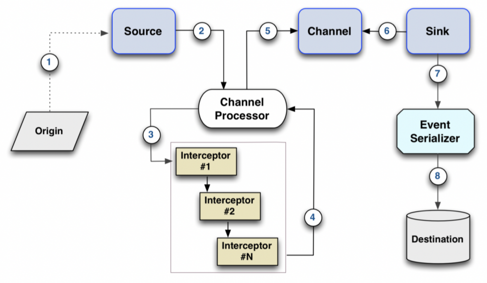
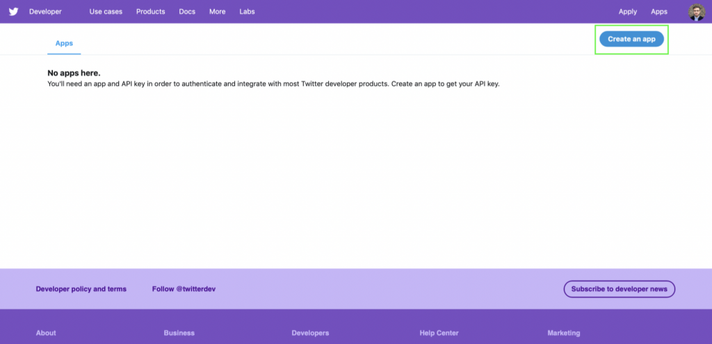
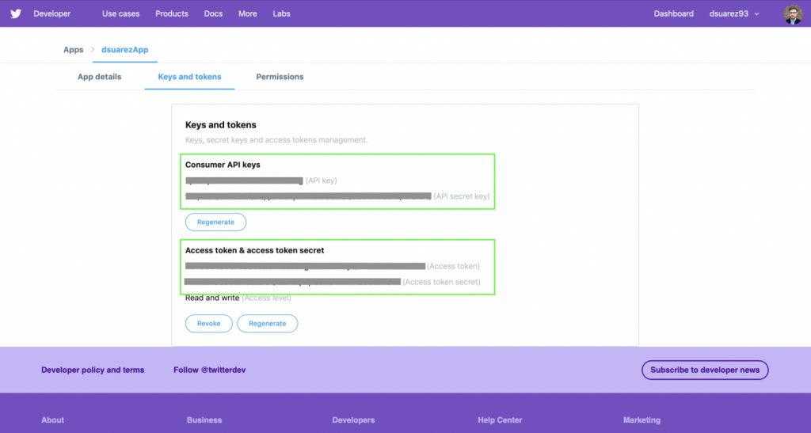

# Real-Time Twitter Analysis 2: Twitter Stream with Flume

We already discussed the architecture for this project in my previous post here. Now, it’s time for jumping into the mood and start working on it. The first step is to ingest the Twitter Stream into our cluster. For this task, we’ll use Apache Flume and Apache Kafka, which in conjunction are also known as Flafka.

Before starting with the implementation, let’s explain what Apache Flume is, and for what is used.

## What is Apache Flume?
Flume is a high-performance system that is widely used for data collection of any streaming event data. It supports aggregating data from many sources into HDFS, and it’s horizontally-scalable, extensible, and reliable.

The achitecture of Flume consists of four main components:

- Source: Receives events from an external source that generates them.
- Channel: It acts like a buffer that keeps the events from the source until they are drained by the sink.
- Sink: Sends an event to a specific destination.
- Agent: It’s a Java process that configures and hosts the source, channel, and sink.

The agents are configured with a Java Property file where we can define all the components we like to use for our use case.

Flume by default incorporates some built-in data sources ready to use for Syslog, Netcat, Exec, Spooldir, HTTP, or Kafka. And also, some sinks for Logger, IRC, HDFS, Kafka, or HBase. The channels available by default are memory (extremely fast but not reliable), file (slower but reliable), and Kafka (scalable and highly available). Besides these built-in implementations, we can also create our own if we like.

Flume also supports other ways to customize data flow that can inspect, modify or transform event data on-the-fly by implementing interceptors, or control the format of messages when they are written to the destination with event serializers.

Here you can see a map that illustrates the whole Flume architecture.



We already know what Flume is, so now it’s time to think about our use case.

## What are we going to do with Flume?

This is what we know we have to apply for now:

- Origin: Our origin is Twitter API.
- Source: We need a source to consume Twitter Stream - events.
- Channel: Memory, in this case, we need something fast and we could assume some tweets lost.
- Sink / Destination: Kafka, because it will distribute the data collected among the cluster into topics, and they would be consumed by as many consumers as needed.

## Getting credentials to use our data origin: Twitter API

First things first, in order to use the Twitter API we need a developer Twitter account, you can log in or sign up [here](https://developer.twitter.com/). After that, we can proceed to create a Developer App by fulfilling the form, and finally generate our API credentials, as it is shown in the pictures above.






## Twitter Stream Source

Now that we have our Twitter API keys, we can consume data from Twitter, and for that, in this case, we’ll need a Flume Source. Before re-inventing the wheel lets see what has already been done by other people.

After investigating a bit we can see that Flume incorporates a built-in source for Twitter Stream, but as the [official documentation says](https://flume.apache.org/releases/content/1.6.0/FlumeUserGuide.html#twitter-1-firehose-source-experimental), is experimental, and moreover, it transforms the input data (formerly JSON) to AVRO format, so it’s mainly meant for data storing instead of processing.

Another option is to apply the [Cloudera’s implementation](https://github.com/cloudera/cdh-twitter-example/tree/master/flume-sources/src/main/java/com/cloudera/flume/source). After analyzing it in deep, we see that this one uses the [Twitter4j](http://twitter4j.org/en/index.html) library and works directly with JSON events without applying any extra transformations, however it doesn’t make use of the whole Twitter library possibilities, and some of them could be interesting for our use case.

Finally, I decided to take this last implementation as a starting point, and add some changes to complete it.

## Building a Custom Source for Twitter Stream

Custom Sources are written in Java, so for this, I am going to use the Eclipse (Luna) IDE that comes pre-installed into the Cloudera’s Quickstart VM, so the instructions detailed here are related to that IDE.

First, we need to start a new Maven project in Eclipse, for that, we go to File –> New –> Project –> Maven Project, then we leave all the settings by default, and we add a Group ID and Artifact ID, and press Finish.

Once the project is already created, we need to add the required dependencies (for Flume and Twitter4j) to our POM.xml:
```
<dependency>
   <groupId>org.apache.flume</groupId>
   <artifactId>flume-ng-core</artifactId>
   <version>1.6.0</version>
   <scope>provided</scope>
</dependency>
<dependency>
<groupId>org.twitter4j</groupId>
   <artifactId>twitter4j-stream</artifactId>
   <version>3.0.6</version>
</dependency>
```

Now we can proceed to implement our Twitter Source Class. This must extend from the AbstractSource Class and implements the Configurable interface, and because in this case, this source is Event Driven (because it will react to events that are upcoming tweets) we also need to implement the EventDrivenSource interface. All of them imported from the org.apache.flume library.

This will require us to implement the Configure, Start, and Stop methods. Configure method will be triggered before starting, so there we need to initialize our Twitter Stream listener. On Start, we’ll need to start listening and processing events, we can see an [implemented example in the official Twitter4j website](http://twitter4j.org/en/code-examples.html#streaming). Finally, on Stop, we clean up our variables when the execution stops.

In this case, I added two more properties to the TwitterStream such as locations and follows. You can see part of my implementation below, if you want to check the whole implementation, you can check it on my GitHub.

```
public class TwitterSource extends AbstractSource implements EventDrivenSource, Configurable {
 
    private String consumerKey;
    ...
    private  TwitterStream twitterStream;
 
    @Override
    public void configure(Context context) {
        consumerKey = context.getString(TwitterSourceConstants.CONSUMER_KEY_KEY);
        consumerSecret = context.getString(TwitterSourceConstants.CONSUMER_SECRET_KEY);
        accessToken = context.getString(TwitterSourceConstants.ACCESS_TOKEN_KEY);
        accessTokenSecret = context.getString(TwitterSourceConstants.ACCESS_TOKEN_SECRET_KEY);
        ...
        keywords = tqpp.getKeywords(keywordString);
        ...
        follows = tqpp.getFollows(followString);
        ...
        locations = tqpp.getLocations(locationString);
        ConfigurationBuilder cb = new ConfigurationBuilder();
        cb.setDebugEnabled(true)
          .setOAuthConsumerKey(consumerKey)
          ...
          .setJSONStoreEnabled(true);
 
        twitterStream = new TwitterStreamFactory(cb.build()).getInstance();
    }
 
    @Override
    public void start() {
        final ChannelProcessor channel = getChannelProcessor();
        final Map<String, String> headers = new HashMap<String, String>();
        StatusListener listener = new StatusListener(){
        public void onStatus(Status status) {
            System.out.println(status.getUser().getName() + " : " + status.getText());
            logger.debug("Tweet arrived");
            headers.put("timestamp", String.valueOf(status.getCreatedAt().getTime()));
            Event event = EventBuilder.withBody(
                DataObjectFactory.getRawJSON(status).getBytes(), headers);
            channel.processEvent(event);
            }
            ...
        };
  
        twitterStream.addListener(listener);
    
        if (keywords.length == 0 && follows.length == 0 && locations.length == 0) {
            twitterStream.sample();
        } else {
            FilterQuery query = new FilterQuery();
            if (keywords.length > 0) query.track(keywords);
            if (follows.length > 0) query.follow(follows);
            if (locations.length > 0) query.locations(locations);
            twitterStream.filter(query);
        }
        super.start();
    }
 
    @Override
    public void stop() {...}
}
```

Then when everything is ready, we have to compile the project. For do this, we go to the project folder and we run the “mvn package” command and we’ll get the JAR file generated inside of the “target” folder.

Now, thanks to this implementation, we can configure the Twitter Stream Source with parameters such as topics, locations, and follows.

Unfortunately, I couldn’t add another property for choosing the language of the tweets here, and it would be really nice if we can only consume tweets in English because that will help us a lot during the text analysis. However, we have another option to do it, that is implementing an Interceptor to filter out all those tweets not written in English!

## Building a Custom Interceptor

We have to create a new Maven Project again, and add the following dependencies (for Flume and JSON) to the POM.xml:
```
<dependency>
    <groupId>org.apache.flume</groupId>
    <artifactId>flume-ng-core</artifactId>
    <version>1.6.0</version>
</dependency>
<dependency>
    <groupId>org.json</groupId>
    <artifactId>json</artifactId>
    <version>20180813</version>
</dependency>
```

Now we can proceed to implement our Twitter Interceptor Class. For creating an interceptor we need to implement the Interceptor interface from the Flume library. This one we’ll require us to implement the following methods: builder, initialize, intercepts (event), intercept (list of events), and close. On builder, we build the interceptor.

On initialize, we must initialize any object needed later on (nothing in this case). On intercept (event), we add functionalities to transform the intercepted event on-the-fly, in this case, we parse the event to JSON object, and if the “language” property is not “en”, we transform the whole event to null (filtering it out). On intercept (list of events) for every event in the list, we call the intercept(event) method. Finally, on close, we clean the variables if needed (not in this case).

Here you can see a partial implementation of the code, if you want to see more, check it on my GitHub.

```
public class TwitterInterceptor implements Interceptor {
 
    public static class Builder implements Interceptor.Builder {
 
        @Override
        public void configure(Context ctx) { }
 
        @Override
        public Interceptor build() {
            return new TwitterInterceptor();
        }
    }
 
    @Override
    public void initialize() { }
 
    @Override
    public Event intercept(Event event) {
        String eventBody = new String(event.getBody());
        try {
            JSONObject tweetJson = new JSONObject(new String(eventBody));
            String tweet_lang = tweetJson.getString("lang");
            if(!tweet_lang.equals("en")){
                return null;
            }
        } catch (JSONException e) {
            ...
        }
        return event;
    }
 
    @Override
    public List<Event> intercept(List<Event> events) {
        List<Event> result = new ArrayList<Event>();
        for(Event event: events){
            Event intercepted = intercept(event);
            result.add(intercepted);
        }
        return result;
    }
 
    @Override
    public void close() { }
}
```

Then when everything is ready, we have to compile the project. For do this, we go to the project folder and we run the “mvn package” command and we’ll get the JAR file generated inside of the “target” folder.

Great! Now we have everything ready to configure our Flume agent!

## Configuring the Flume Agent

Before doing this, we need to add our Custom Source and Custom Interceptor and their dependencies to Flume.

- Copy Custom Source JAR to /etc/flume-ng/plugins.d/twitter-source/lib
- Add the Twitter4j dependency JAR to /etc/flume-ng/plugins.d/twitter-interceptor/libext
- Copy Custom Interceptor JAR to /etc/flume-ng/plugins.d/twitter-interceptor/lib
- Add the json dependency JAR to /etc/flume-ng/plugins.d/twitter-interceptor/libext

Now, we create a new file named “flume_twitter_to_kafka.conf” and write the following configuration:

```
agent1.sources = src-twitter-stream
agent1.sinks = snk-kafka
agent1.channels = ch-memory

agent1.sources.src-twitter-stream.type = com.davidiscoding.flumetwittersource.TwitterSource
agent1.sources.src-twitter-stream.channels = ch-memory
agent1.sources.src-twitter-stream.consumerKey = ...
agent1.sources.src-twitter-stream.consumerSecret = ...
agent1.sources.src-twitter-stream.accessToken = ...
agent1.sources.src-twitter-stream.accessTokenSecret = ...
agent1.sources.src-twitter-stream.locations = -124.48,32.53,-114.13,42.01
agent1.sources.src-twitter-stream.interceptors = twitter-interceptor
agent1.sources.src-twitter-stream.interceptors.twitter-interceptor.type = com.davidiscoding.flumetwitterinterceptor.TwitterInterceptor$Builder

agent1.channels.ch-memory.type = memory
agent1.channels.ch-memory.capacity = 10000
agent1.channels.ch-memory.transactionCapacity = 1000

agent1.sinks.snk-kafka.type = org.apache.flume.sink.kafka.KafkaSink
agent1.sinks.snk-kafka.topic = twitter_stream
agent1.sinks.snk-kafka.brokerList = quickstart.cloudera:9092
agent1.sinks.snk-kafka.batchSize = 20
agent1.sinks.snk-kafka.channel = ch-memory
```

This will set up a Flume configuration with our Custom Twitter Source as the Source, with our Custom Interceptor, a Memory Channel, and a Kafka topic called “twitter_stream” as a Sink.

Note: Because the production of tweets worldwide is huge, the Twitter Stream API only allows us to get 1% of all the generated tweets in real-time. Without any filter in the API query, we would get tweets from everywhere. This means, lots of different languages, and rarely, users speaking about the same topics. In order to mitigate this problem that would cause a negative effect during the tweet analysis, I decided to restrict the location of tweets to the area of Californa (-124.48,32.53,-114.13,42.01), where most of the people speak English (fewer tweets will be filtered out), and more people will speak about the same topics.

## Running the Flume Agent and Enjoying with the Result

Before executing our Flume Agent, we need to create our Kafka topic first, for this, open a terminal and run:

```
kafka-topics --zookeeper quickstart.cloudera:2181 --create --topic twitter_stream --partitions 1 --replication-factor 1
```

Now we can proceed to run our Flume Agent, for this, open a terminal, move to the folder where our configuration file is located, and run:

```
flume-ng agent --conf /etc/flume-ng/conf \
--conf-file flume_twitter_to_kafka.conf \
--name agent1 \
--plugins-path /etc/flume-ng/plugins.d/ \
-Dflume.root.logger=INFO,console
```

Then, we’ll see the agent working in our terminal displaying all the tweets text that passes our interceptor filter.

To check that the tweets are draining in our Kafka topic, we can open another terminal and run a consumer as follows:

```
kafka-console-consumer --zookeeper quickstart.cloudera:2181 --topic twitter_stream
```

The final output we’ll look like in this [video](https://youtu.be/_f8Tl9m73Ns).

Finally, we got a Twitter Stream ingested in our cluster!! Next step: process and analyze tweets in real-time with Apache Spark Streaming.


