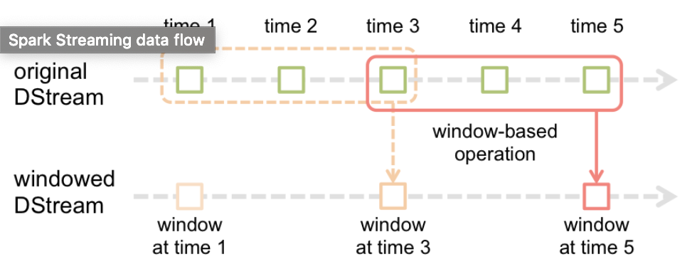

# Real-Time Twitter Analysis 3: Tweet Analysis on Spark

We already got a Twitter Stream ingested in our cluster using Flume and Kafka, as was described in my previous post. The next step is to process and analyze tweets taken from a Kafka topic with Apache Spark Streaming.

Our goal here is to make some calculations on top of the received tweets in order to understand what is happening in the social network. We will focus on checking what the trending hashtags (#) are, who the most mentioned users (@) are, and who the most active users are (those that tweet the most). On top of that, we are also interested in knowing the sentiment of those tweets. In other words, we want to know if the users are speaking in a positive or negative way about a certain topic or user, or even if a user is more positive or negative in its tweets.

## What is Apache Spark Streaming?

Before start getting our hands dirty, I like to briefly explain what Spark Streaming is, but for that we need to start from Spark.

Spark is an open-source cluster-computing framework written in Scala used for large-scale data processing, with an API available for Scala, Python, and Java. Its fundamental unit of data is the RDD Resilient (if data in memory is lost, can be recreated), Distributed (processed across the cluster), Dataset (initial data can come from a source such as a file, or it can be created programmatically).

There are two different operations with RDDs: Transformations (create a new RDD from an existing one), and Actions (return values). These operations heavily depend on Functional Programming, and any RDD is processed until an action is performed.

From the programmer point of view, we can imagine an RDD like an abstract batch of data that represents data distributed in our cluster, so we, as programmers, can know the format and shape of this data, and what operations we would like to perform on it.

## Spark Streaming

Spark Streaming is an extension of the core Spark API that enables scalable, high-throughput, fault-tolerant stream processing of live data streams. Spark Streaming can be used to stream live data and processing can happen in real time.

Basically, it dives up to a data stream into batches of n seconds called DStream (Discretized Stream), processes each batch in Spark as an RDD, and return the results in batches.

The basic DStreams operations analyse each batch individually, meanwhile, the advanced operations allow us to analyze data collected across batches. For this is important to understand the following concepts:

- Batch duration: every batch will contain all the data consumed during that specific duration time.
- Window: allows you to aggregate data across a sliding time period.
- Window length: defines how long the window will be. This means the data baches of the last specified time will be aggregated.
- Sliding time: specified every how many seconds the window will be displaced forward in time.



The picture above may help to understand these concepts. We are going to apply them during this project. If you like to know more about Spark Streaming, you can check the official documentation [here](https://spark.apache.org/docs/latest/streaming-programming-guide.html).

## Processing the Tweet Stream

In this case, I opted by Python as a programming language to program this solution, because I feel more comfortable using it than Scala.

Now let’s start coding. First, import the Spark classes we need:

```
from pyspark import SparkContext
from pyspark.streaming import StreamingContext
from pyspark.streaming.kafka import KafkaUtils
Intialize the Spark StreamingContext with 2 seconds as a batch interval, and establish a checkpoint directory:

sc = SparkContext()
batch_interval = 2
ssc = StreamingContext(sc, batch_interval)
ssc.checkpoint("twittercheckpt")
Start reading from the Kafka Topic (“tweet_stream”) where we are placing the tweets with Flume:

twitterKafkaStream = KafkaUtils. \
         createDirectStream(ssc, ["tweet_stream"], {"metadata.broker.list": "quickstart.cloudera:9092"})
```

Time to clean our tweets. They come in JSON format, therefor we need a library to manage them. Add this line to the imports section at the beginning:

```
import json
```

Then we will get rid of the noise, and we will take only the values that are interesting for us. In this case: the user name who tweets, and the written text.

```
tweets = twitterKafkaStream. \
        map(lambda (key, value): json.loads(value)). \
        map(lambda json_object: (json_object["user"]["screen_name"], json_object["text"]))
```

## Aggregating Sentiment Analysis

Now it’s a great time to calculate and aggregate the sentiment of the tweets. For that, we are going to use a library called TextBlob, so first we need to import it.

```
from textblob import TextBlob
```

This allows us to retrieve the sentiment polarity of a text, which is a number from -1 (so negative), to 1 (so positive). We only want to categorize the tweets as positive, neutral, or negative, for that we will use a tuple to represent it “(negative, neutral, positive)”. However, to get this done, we need to set a threshold o neutrality, in this case, I have chosen +-0.05. For this I’ve implemented a couple of functions:

```
def analyze_sentiment(text):
    testimonial = TextBlob(text)
    return testimonial.sentiment.polarity

def get_sentiment_tuple(sent):
    neutral_threshold = 0.05
    if sent >= neutral_threshold:       # positive
        return (0, 0, 1)
    elif sent > -neutral_threshold:     # neutral
        return (0, 1, 0)
    else:                               # negative
        return (1, 0, 0)
```

We already have everything we need to aggregate the sentiment analysis veredict to our tweets in the DStream.

```
tweets_sentiment_analysed = tweets. \
        map(lambda (user, text): (user, text, get_sentiment_tuple(analyze_sentiment(text))))
```

We are going to use this DStream as a starting point for all of our calculations (lineage branches), so we need to persist it first. For that first we need to add the StorageLevel Spark class to the imports section.

```
from pyspark import StorageLevel
tweets_sentiment_analysed.persist(StorageLevel.MEMORY_AND_DISK)
```

## Making calculations with tweets of the last 15 minutes

### Top 10 Hashtags

Here, we: change the tuple composition to execute the flatMap next, then we create a tuple for each word in the text with the same user and sent values, then we filter all the words that don’t start with “#”, and finally we reorder the tuple adding a value 1 to preapare it for the reduce operation.

```
hashtags = tweets_sentiment_analysed. \
        map(lambda (user, text, sent): ((user, sent), text)). \
        flatMapValues(lambda text: text.split(" ")). \
        filter(lambda (kp, w): len(w) > 1 and w[0] == '#'). \
        map(lambda ((user, sent), hash): (hash, (1, sent)))
```

Now we reduce by key and window. For every pair of entries in the DStream, we sum the value 1, and the sentiment veredict. As a result we get the total count, and tweet sentiment veredict of each hastag.

```
hashtags_count_acc_sent = hashtags. \
     reduceByKeyAndWindow(lambda (c1, s1), (c2, s2): (c1+c2, (s1[0]+s2[0], s1[1]+s2[1], s1[2]+s2[2])), None, 15*60, 6)
```

Then, we reorder the tuple to sort by the hashtag count and reorder back once sorted.

```
sorted_hashtags = hashtags_count_acc_sent. \
     map(lambda (hash, (count, sent)): (count, (hash, sent))). \
     transform(lambda rdd: rdd.sortByKey(False)). \
     map(lambda (count, (hash, sent)): (hash, (count, sent)))
```

Now we can print the first 10 elements of our DStream, which are the top 10 hashtags of the last 15 min computed.

sorted_hashtags.pprint(10)

### Top 10 Mentioned Users

The code, in this case, is exactly the same, we only need to replace the filter character “#” by “@”. And of course, change the name of the variables.

Note: Yes, you are right, we could make a function and reduce duplicity, but not in this post.

### Top 10 Most Active Users

We start again from our “tweet_sentiment_analysed” DStream. Here we get rid of the text of the tweet, set “user” as the key of the tuple, and (1, sent) as value to prepare it for the reduce operation.

```
users = tweets_sentiment_analysed. \
    map(lambda (user, text, sent): (user, (1, sent)))
```

With the reduce by key and window operation, we sum the count of all the tweets posted by a user, and sum the sentiments during the last 15 minutes.

```
user_count_acc_sent = users. \
    reduceByKeyAndWindow(lambda (c1, s1), (c2, s2): (c1 + c2, (s1[0] + s2[0], s1[1] + s2[1], s1[2] + s2[2])), None, 15*60, 6)
```

Then, we reorder the tuple to sort by the users tweets count and reorder back once sorted.

```
sorted_users = user_count_acc_sent. \
    map(lambda (user, (count, sent)): (count, (user, sent))). \
    transform(lambda rdd: rdd.sortByKey(False)). \
    map(lambda (count, (user, sent)): (user, (count, sent)))
```

Again, we can proceed to show the top 10 most active users of the las 15 minutes.

```
sorted_users.pprint(10)
```

### Total Counters

Let’s also calculate the total number of tweets analyzed, and how many of them are either negative, neutral, or positive.

Starting again from the “tweets_sentiment_analysed” DStream, we get rid of the text and we create a tuple per each entry with the same key “count” and (1, sent) as a value in order to prepare it for the reduce operation.

```
tweets_to_count = tweets_sentiment_analysed. \
    map(lambda (user, text, sent): ('count', (1, sent)))
```

We reduce by key and window to get the sum of all the tweets posted in the last 15 minutes.

```
tweets_count_acc_sent = tweets_to_count. \
    reduceByKeyAndWindow(lambda (c1, s1), (c2, s2): (c1 + c2, (s1[0] + s2[0], s1[1] + s2[1], s1[2] + s2[2])), None, 5*60, 6)
```
We get tid of the key, to leave only the counts.

```
total_count = tweets_count_acc_sent. \
    map(lambda (k, (count, sent)): (count, sent))
```

Finally, we print the resulting counters.

```
total_count.pprint()
```


## Finishing

With this we’ve already finished all the calculations. Don’t forget to start the SparkStreaming application and call await termination.

```
ssc.start()
ssc.awaitTermination()
```

If you want to see the final version of the code explained here, you can check it on my GitHub.

The next step will be sending and displaying all this information on a web-based Dashboard.
