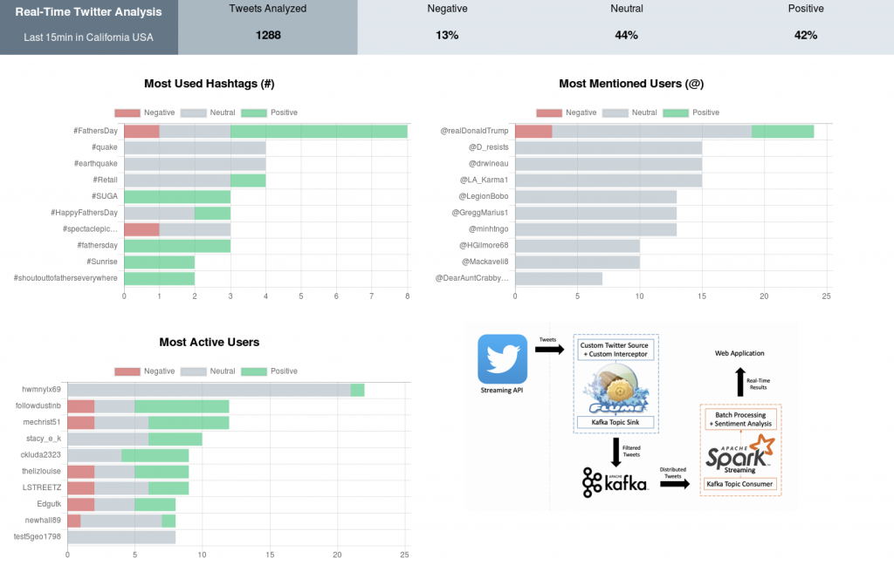

# Real-Time Twitter Analysis 4: Displaying the Results

In the previous post, we processed a stream of tweets in real-time with Spark Streaming in order to calculate son information such as tops and counters. Now is the turn of displaying this data in an easier way to be consumed by humans.

Along with this post, we’ll create a simple web-based Dashboard by using Flask (a web micro-framework), and we’ll send data to it from our Spark Streaming application.

## Building the Dashboard with Flask

Flask is an open-source web micro-framework that allows us to create and run webpages quite quickly using Python as the main programming language. We opted by this one on top of the others because is easy, straightforward, and uses Python, which makes it perfect for a simple solution like this.

For building this dashboard we’re also making use of HTML, JavaScript, CSS, and a library called Chart.js for displaying charts.

The final result will look like this:



The folder organization and content of our Flask project folders will be as follows:

- TwitterAnalysisDashboard
    - static
    - js
        - lib
            - Chart.js
        - counters_setter.js
        - most_active_users_chart.js
        - most_mentioned_users.js
        - most_used_hashtags.js
    - css
        - dashboard.css
    - templates
        - dashboard.html
    - app.py

I don’t want to expend too much time explaining this in detail, so I will explain only the most important parts of it. The web API to receive data from Spark, and how this data is displayed.

## Flask Server (App.py)

Let’s start importing the classes needed and intializing the app.

```
from flask import Flask, jsonify, request
from flask import render_template
import ast
app = Flask(__name__)
```

We are going to create some global variables in order to store the data coming from the Spark application.

```
tweet_counters = {'total': 0, 'negative': 0, 'neutral': 0, 'positive': 0}
 most_used_hashtags = {'labels': [], 'negative': [], 'neutral': [], 'positive': []}
 most_active_users = {'labels': [], 'negative': [], 'neutral': [], 'positive': []}
 most_mentioned_users = {'labels': [], 'negative': [], 'neutral': [], 'positive': []}
```

We expose a route to access to our Dashboard, this route will deliver the web page.

```
@app.route("/")
def get_dashboard_page():
    global most_used_hashtags, most_active_users, most_mentioned_users
 
    return render_template(
        'dashboard.html',
        tweet_counters=tweet_counters,
        most_used_hashtags=most_used_hashtags,
        most_active_users=most_active_users,
        most_mentioned_users=most_mentioned_users)
```

Now we need to provide an endpoint to let the Spark application send the data to the server. Here I show only one example, the rest follows the same implementation.

```
@app.route('/update_most_used_hashtags', methods=['POST'])
def update_most_used_hashtags_data():
    global most_used_hashtags
    if not request.form not in request.form:
        return "error", 400
 
    most_used_hashtags['labels'] = ast.literal_eval(request.form['label'])
    most_used_hashtags['negative'] = ast.literal_eval(request.form['negative'])
    most_used_hashtags['neutral'] = ast.literal_eval(request.form['neutral'])
    most_used_hashtags['positive'] = ast.literal_eval(request.form['positive'])
 
    return "success", 201
```

And we also need to provide access to the data from the web page. Again, I only show one example, because the rest is almost the same.

```
@app.route('/refresh_most_used_hashtags')
def refresh_most_used_hashtags_data():
    global most_used_hashtags
 
    return jsonify(
        sLabel=most_used_hashtags['labels'],
        sNegative=most_used_hashtags['negative'],
        sNeutral=most_used_hashtags['neutral'],
        sPositive=most_used_hashtags['positive'])
```

And finally, we need to run the server and make it accessible from a specific host and port.

```
if __name__ == "__main__":
     app.run(host='localhost', port=5001)
```

## Consuming Data Stored in Server from JavaScript

We need to display the data on the browser, for that we will use JavaScript to access the data using the web API we defined, and the Chart.js library to display it in a proper way. Here I only show one example, the rest of charts have almost the same implementation.

This code will set and refresh the “most_used_hashtag_chart” every 2 seconds.

```
var ctx = document.getElementById('most_used_hashtags_chart').getContext('2d');
 var most_used_hashtags_chart = new Chart(ctx, {
     type: 'horizontalBar',
     data: {
         labels: [],
         datasets: [{
            label: "Negative",
            data: [],
            backgroundColor: "rgba(194, 67, 67, 0.6)"
        },{
            label: "Neutral",
            data: [],
            backgroundColor: "rgba(170, 184, 194, 0.6)"
        },{
            label: "Positive",
            data: [],
            backgroundColor: "rgba(67, 194, 122, 0.6)"
        }]
    },
 });
 var src_data_most_used_hashtags= {
     labels: [],
     negative: [],
     neutral: [],
     positive: []
 }
 setInterval(function(){
     $.getJSON('/refresh_most_used_hashtags', {
     }, function(data) {
         src_data_most_used_hashtags.labels = data.sLabel;
         src_data_most_used_hashtags.negative = data.sNegative;
         src_data_most_used_hashtags.neutral = data.sNeutral;
         src_data_most_used_hashtags.positive = data.sPositive;
     });
     most_used_hashtags_chart.data.labels = src_data_most_used_hashtags.labels;
     most_used_hashtags_chart.data.datasets[0].data = src_data_most_used_hashtags.negative;
     most_used_hashtags_chart.data.datasets[1].data = src_data_most_used_hashtags.neutral;
     most_used_hashtags_chart.data.datasets[2].data = src_data_most_used_hashtags.positive;
     most_used_hashtags_chart.update();
 },2000);
```

With this, we’ve covered the most important parts of the Dashboard creation. If you like to check the rest of the implementation, you can do it on my GitHub.

## Sending Data from Spark Streaming to the Dashboard

Turn to send data from our Spark Streaming application to our dashboard.

For this purpose, we are editing our Spark program to replace the DStream “”pprint() function that we were using for printing the results of our calculations, by custom functions that will send the data in the desired format to our dashboard using a library called “requests”.

First we need to add the “requests” library to the imports section.

```
import requests
```

Now we create a function to send the tops to a specific HTTP route. For each RDD in the DStream, if it is not empty, we take the values of the first 10 entries, and we send it using requests.posts to the specified route.

```
def send_top_to_dashboard(dstream_tweets_sentiment_analysed, api_endpoint):
    num = 10
    def take_and_send(time, rdd):
        if not rdd.isEmpty():
            taken = rdd.take(num)
            labels = []
            negative = []
            neutral = []
            positive = []
            for (name, (count, (neg, neu, pos))) in taken:
                labels.append(name)
                negative.append(neg)
                neutral.append(neu)
                positive.append(pos)
 
            url = 'http://localhost:5001/' + api_endpoint
            request_data = {'label': str(labels), 'negative': str(negative), 'neutral': str(neutral), 'positive': str(positive)}
            response = requests.post(url, data=request_data)
     
    dstream_tweets_sentiment_analysed.foreachRDD(take_and_send)
```

And we do the same to send the counters. In this case the values will be in the first entry, of the RDD, so we take them and send them to a specific HTTP route.

```
def send_counters_to_dashboard(dstream_tweets_sentiment_analysed, api_endpoint):

    def take_and_send(time, rdd):
        if not rdd.isEmpty():
            (total, (negative, neutral, positive)) = rdd.first()
            url = 'http://localhost:5001/' + api_endpoint
            request_data = {'total': total, 'negative': negative, 'neutral': neutral, 'positive': positive}
            response = requests.post(url, data=request_data)
 
   dstream_tweets_sentiment_analysed.foreachRDD(take_and_send)
```

Finally, we only need to replace the “pprint()” call, for our custom functions indicating the server route where they will be stored.

```
send_top_to_dashboard(sorted_hashtags, 'update_most_used_hashtags')
send_top_to_dashboard(sorted_mentioned, 'update_most_mentioned_users')
send_top_to_dashboard(sorted_users, 'update_most_active_users')

send_counters_to_dashboard(total_count, 'update_tweet_counters')
```

With this done, we are ready to go!! If we want to see the full and final version of this code, check it on my GitHub.

## Running the Whole Project!

Time to make it run and see the result.

- Run the Flume Agent
- Run the Dashboard
- Run the Spark Streaming job

On [this video](https://youtu.be/-vr9UDnxPjI) you can see a demonstration of everything working. Enjoy!!
